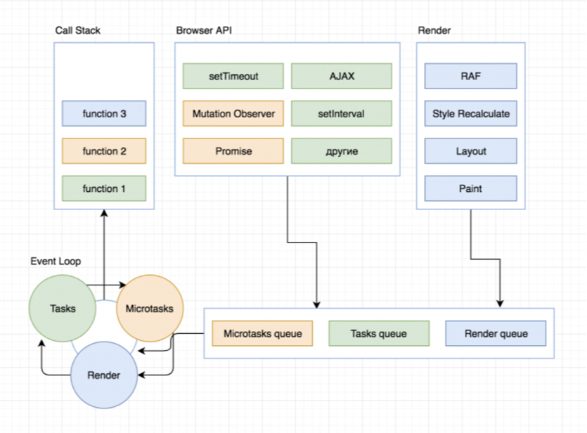
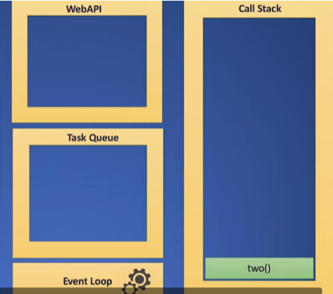

# Event-cycle

### **Цикл событий**

это механизм, на каждом тике выполняющий функции из стека вызовов и, если он оказывается пустым, перемещающий задачи из очереди задач в стек вызовов для выполнения.

- Цикл событий имеет одну или несколько очередей задач (очередь задач - это очередь макрозадач).
- Каждый цикл событий имеет очередь микрозадач.
- очередь задач = очередь макрозадач! = очередь микрозадач
- задача может быть помещена в очередь макрозадач или очередь микрозадач
- когда задача помещается в очередь (микро / макрос), мы имеем в виду, что подготовительная работа завершена, и теперь задача может быть выполнена.





### **Стек вызовов**

это структура данных (первым вошел, последним вышел), используемая для отслеживания порядка выполнения функций в текущем контексте (области видимости).

### **Очередь задач**

это структура данных (первым вошел, первым вышел), используемая для отслеживания выполнения асинхронных функций, готовых оказаться в стеке вызовов.

## [Главный поток](https://learn.javascript.ru/events-and-timing-depth#glavnyy-potok)

В каждом окне выполняется только один *главный* поток, который занимается выполнением JavaScript, отрисовкой и работой с DOM.

Он выполняет команды последовательно, может делать только одно дело одновременно и блокируется при выводе модальных окон, таких как `alert`.

**Дополнительные потоки тоже есть**

Есть и другие, служебные потоки, например, для сетевых коммуникаций.

Поэтому скачивание файлов может продолжаться пока главный поток ждёт реакции на `alert`. Но управлять служебными потоками мы не можем.

# Promise

это объект, который представляет результат асинхронной операции или задачи, которая еще не завершилась, но которую мы ожидаем. Он позволяет выполнить асинхронный код в более легком и читаемом стиле, избегая использования обратных вызовов (callback) или синхронизации потоков (thread synchronization) в JavaScript.

### Cостояния

- **`pending`** (ожидание) - начальное состояние, когда промис создан, но не выполнен и не отклонен.
- **`fulfilled`** (выполнено) - когда выполнение асинхронной операции завершено успешно и промис возвращает результат.
- **`rejected`** (отклонено) - когда выполнение асинхронной операции завершилось неудачно и промис возвращает ошибку.

## Методы

**`Promise.all()`**

возвращает промис, который выполнится тогда, когда будут выполнены все промисы, переданные в виде перечисляемого аргумента, или отклонено любое из переданных промисов.

**`Promise.allSettled()`**

возвращает промис, который исполняется когда все полученные промисы завершены (исполнены или отклонены), содержащий массив результатов исполнения полученных промисов.

`**Promise.any()**`

принимает итерируемый объект содержащий объекты промисов. Как только один из промисов выполнится успешно, метод возвратит единственный объект Promise со значением выполненного промиса. Если ни один из промисов не завершится успешно, тогда возвращённый объект будет отклонён.

**`Promise.race()`**

возвращает выполненный или отклонённый промис, в зависимости от того, с каким результатом завершится первый из переданных промисов, со значением или причиной отклонения этого промиса.

**`Promise.reject(reason)`**

возвращает объект Promise, который был отклонён по указанной причине.

**`Promise.resolve(value)`**

возвращает Promise выполненный с переданным значением.

## async/await

относительно новый способ написания асинхронного (неблокирующего) кода в JS. Он делает код более читаемым и чистым, чем промисы и функции обратного вызова.

# async/defer

**[defer](https://learn.javascript.ru/script-async-defer#defer)**

- Атрибут defer сообщает браузеру, что он должен продолжать обрабатывать
страницу и **загружать скрипт в фоновом режиме**, а затем запустить этот скрипт, когда DOM дерево будет полностью построено.
- Сохраняет порядок загрузки

[**async**](https://learn.javascript.ru/script-async-defer#async) означает, что скрипт абсолютно независим:

- Страница не ждёт асинхронных скриптов, содержимое обрабатывается и отображается.
- Событие DOMContentLoaded и асинхронные скрипты не ждут друг друга:
- DOMContentLoaded может произойти как до асинхронного скрипта (если асинхронный скрипт завершит загрузку после того, как страница будет готова),
- …так и после асинхронного скрипта (если он короткий или уже содержится в HTTP-кеше)
- Остальные скрипты не ждут async, и скрипты casync не ждут другие скрипты.

## Web Workers

Существует спецификация [Web Workers](https://www.w3.org/TR/workers/), которая позволяет запускать дополнительные JavaScript-процессы(workers).

Они могут обмениваться сообщениями с главным процессом, но у них свои переменные, и работают они также сами по себе.

Такие дополнительные процессы не имеют доступа к DOM, поэтому они полезны, преимущественно, при вычислениях, чтобы **загрузить несколько ядер/процессоров одновременно**.

```tsx
const workerRef = React.useRef(new Worker('./worker.js'));
// Получить worker объект из ссылки
const worker = workerRef.current;
// Отправить некоторые данные worker
worker.postMessage(10);// Зарегистрировать обратный вызов для обработки результата от worker
worker.onmessage = event => {
  console.log(event.data); // 20
};
```

**Примеры того, как можно использовать Web Workers:**

1. **Загрузка больших наборов данных:** Web Workers можно использовать для асинхронной загрузки больших наборов данных, не блокируя основной поток. Это может повысить производительность приложения и сделать его более отзывчивым.
2. **Выполнение дорогостоящих вычислений:** Web Workers можно использовать для выполнения дорогостоящих вычислений, таких как обучение моделей машинного обучения или выполнение сложных математических операций, без блокировки основного потока.
3. **Разгрузка задач обработки изображений:** Web Workers можно использовать для обработки изображений, например, для изменения размера или применения фильтров, без блокировки основного потока.
4. **Запуск симуляций или анимаций:** Web Workers можно использовать для запуска симуляций или анимаций, которые могут быть слишком ресурсоемкими для запуска в основном потоке.

## WebSocket


технология, которая позволяет клиенту установить двухстороннюю ([«дуплексную»](https://ru.wikipedia.org/wiki/%D0%94%D1%83%D0%BF%D0%BB%D0%B5%D0%BA%D1%81_(%D1%82%D0%B5%D0%BB%D0%B5%D0%BA%D0%BE%D0%BC%D0%BC%D1%83%D0%BD%D0%B8%D0%BA%D0%B0%D1%86%D0%B8%D0%B8))) связь с сервером.

Позволяет сайтам отправлять и получать данные без задержки. С помощью веб-сокетов можно создавать многопользовательские игры, мессенджеры, а также сервисы для совместной работы.

```tsx
const socket=new WebSocket('ws://localhost:8080');
socket.addEventListener('open', (event)=> {
  socket.send('Hello Server!');
});

socket.addEventListener('message', (event)=> {
  console.log('Message from server ', event.data);
});

socket.addEventListener('close', (event)=> {
  console.log('The connection has been closed');
});
```

### Задачи:

- **Мессенджеры**: концептуально самая простая реализация веб-сокетов. Пользователи отправляют сообщения на сервер, который мгновенно отправляет эти сообщения получателю. Также сервер может хранить группы подключений в каналах — так можно отправлять сообщения нескольким людям одновременно в общие чаты или просматривать сообщения от нескольких людей, например, в канале Slack.
- **Многопользовательские игры**: общий шаблон для многопользовательских игр заключается в том, что сервер хранит игровое состояние пользователей. Игроки выполняют какие-то действия, которые сразу отправляются на сервер. Он обновляет состояние игры и быстро отправляет его обратно пользователям. С HTTP каждый игрок должен был бы регулярно запрашивать состояние игры. С WebSocket каждое действие мгновенно передается всем игрокам.
- **Приложения для совместной работы:** Веб-сокеты позволяют сразу нескольким пользователям работать в одном документе и мгновенно обновлять его для всех.
- **Инструменты разработчика:** инструменты непрерывной интеграции, такие как CircleCI, используют веб-сокеты для мгновенного уведомления о завершении сборки.
- **Карты**: обновляются моментально при даже небольшом изменении GPS-координат пользователя.