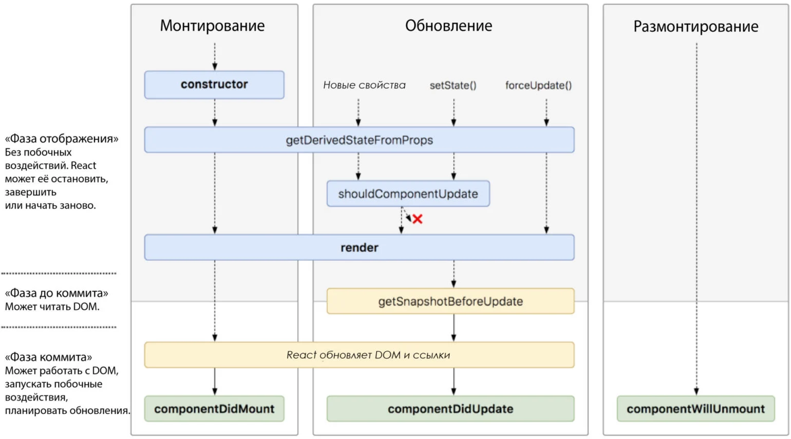

## React

JavaScript библиотека, разработанная Facebook в 2011. В основе лежит компонентный подход, позволяющий создавать переиспользуемые UI-компоненты. Служит для создания сложных интерактивных интерфейсов для веб-сайтов и мобильных приложений.

## Immutable

называется объект, состояние которого **не может быть изменено** после создания. Результатом любой модификации такого объекта всегда будет новый объект, при этом старый объект не изменится.

## **Виртуальный DOM (VDOM)**

это копия Document Object Model, которую в своем ядре выстраивает фреймворк (в данном случае React). Вместо того, чтобы при каждом изменении данных заставлять браузер переформировывать DOM, внутри фреймворка происходит перерасчёт Virtual DOM. Дальше по результатам сравнения построенного Virtual DOM и DOM фреймворк вносит точечные изменения в реальный DOM. 
**Этот механизм существенно повышает производительность React-приложения, так как позволяет избежать ненужных перерисовок и вычислений браузеру**.

## JSX

это дополнение к синтаксису JS, которое позволяет писать HTML в React компонентах.

JSX - синтаксический сахар для функции React.createElement(component, props, ...children).
За правильный парсинг и дальнейшую обработку отвечает babel.

## React Fiber

это новый механизм и базовый алгоритм для рендеринга в React 16. Основная
цель - реализовать пошаговый рендеринг виртуального DOM для более быстрого
рендеринга, работы с анимациями и дебагом.

## Элемент React

это **составляющие блоки React-приложений**. Элемент описывает то, что вы хотите увидеть на экране. React-элементы иммутабельны (не меняються).

## **Компонент React**

это класс или функция, которые возвращают элементы. Входными данными для компонента являются пропы, а в качестве результата компонент отдает JSX дерево.

## Fragment

Специальный элемент `<></>` или `<React.Fragment></React.Fragment>` в React позволяющий возвращать группу элементов без дополнительного родительского DOM элемента

## Контролируемый и неконтролируемый компонент

- Контролируемый компонент обладает своим стейтом, управляемый React
- Неконтролируемые компоненты обладают внутренним стейтом (как пример  значение тега textarea)

## Жизненый цикл



Основные этапы жизненного цикла компонента

- **componentWillMount** перед рендерингом, в основном для настройки компонента
- **render** процесс рендеринга
- **componentDidMount** уведомляет, про то, что компонент соединен с DOM  деревом
- **componentWillReceiveProps** уведомляет, про то, что приходят новые  входящие свойства в компонент
- **shouldComponentUpdate** возвращает true или false и служит для  оптимизации. Решает, нужно ли делать ре-рендеринг
- **componentWillUpdate** уведомляет, что компонент будет обновлен
- **componentDidUpdate** уведомляет, что компонент был обновлен
- **componentWillUnmount** используется для удаления слушателей и очистки  компонента. Вызывается перед удалением компонента

## Контекст

Контекст позволяет передавать данные через дерево компонентов без необходимости передавать пропсы на промежуточных уровнях.

## Компоненты высшего порядка (Higher-Order Component, HOC)

это функция, которая принимает компонент и возвращает новый компонент.

```tsx
const EnhancedComponent = higherOrderComponent(WrappedComponent);
```

## Portal

Порталы позволяют рендерить дочерние элементы в DOM-узел, находящийся вне DOM-иерархии родительского компонента.
Порталы особенно полезны, когда в родительском компоненте заданы стили overflow: hidden или z-index, и нужно, чтобы дочерний элемент визуально выходил за рамки своего контейнера. Это диалоги, модальные окна или всплывающие подсказки.

Типичные примеры использования порталов:

- Модальные диалоговые окна.
- Всплывающие подсказки.
- Всплывающие визитки.
- Загрузчики.

Имея дело с порталами в React, надо помнить о нескольких вещах

- **Всплывающее событие будет работать, как обычно,** распространяя события на предков в дереве React, независимо от местоположения узла портала в DOM.
- **React контролирует узлы портала и его жизненный цикл** при отображении дочерних элементов с помощью этих порталов.
- **Порталы влияют только на структуру DOM** для HTML и не затрагивают дерево компонентов React.
- **Предварительно определяется точка монтирования HTML**: при использовании порталов необходимо определить HTML-элемент DOM в качестве точки монтирования компонента портала.

## Что такое refs в React?

Рефы дают возможность получить доступ к DOM-узлам, к которым они привязаны.

В рефах можно хранить любое значение, а не обязательно ссылку на элемент. Изменение поля ref.current не приводит к реренденру компонента.
Ситуации, в которых использование рефов является оправданным:

- Управление фокусом, выделение текста или воспроизведение медиа.
- Императивный вызов анимаций.
- Интеграция со сторонними DOM-библиотеками.

## Profiler

`Profiler` может быть добавлен в любую часть React-дерева **для измерения стоимости рендеринга этой части**. Он принимает два пропа: `id` (string) и колбэк `onRender` (function), который React вызывает каждый раз, когда компонент внутри дерева «фиксирует» обновление.

Например, так выглядит процесс профилирования компонента `Navigation` и его дочерних компонентов:

```tsx
render(
  <App>    
    <Profiler id="Navigation" onRender={callback}>      
      <Navigation {...props} />    
    </Profiler>    
    <Main {...props} />  
  </App>);
```

## **ErrorBoundary**

это механизм перехвата ошибок. С их помощью можно обработать ошибку и дать пользователю обратную связь, если что-то пошло не так. В идеале - показать кнопку для повторения действия, в результате которого прозошла ошибка.

## **`React.lazy`**

Функция `React.lazy` позволяет рендерить динамический импорт как обычный компонент.

```tsx
const OtherComponent = React.lazy(() => import('./OtherComponent'));
export default OtherComponent
```

Она автоматически загрузит бандл, содержащий `OtherComponent`, когда этот компонент будет впервые отрендерен.

## ****Suspense****

`<Suspense>`позволяет отображать запасной вариант, пока его дочерние элементы не закончат загрузку.

```tsx
<Suspense fallback={<Loading />}>  <SomeComponent /></Suspense>
```

## Вопросы:

### В чем разница memo и useMemo?

**memo** — это компонент высшего порядка, предоставляемый React.

Он нужен для повышения производительности и подходит для случаев, когда компонент рендерит одинаковый результат при одних и тех же значениях пропсов. В этом случае результат будет мемоизирован. Это значит, что React будет использовать результат последнего рендера, избегая повторного рендеринга.

При использовании **memo** пропсы по умолчанию сравниваются поверхностно. Можно передать свою функцию сравнения в качестве второго аргумента (если нужно контролировать сравнение).

**useMemo**- это хук, который возвращает мемоизированное значение функции, делающей вычисления. Эта оптимизация помогает избежать дорогостоящих вычислений при каждом рендере. **useMemo** будет повторно вычислять мемоизированное значение только тогда, когда значение какой-либо из зависимостей изменится.

### Что такое **prop drilling** и как этого избежать?

передача свойств напрямую от родителя к ребенку через длинную иерархию компонентов. Избежать этого можно за счет использования Context или менеджера состояния, такого как Redux.

### Как оптимизировать React-приложение?

избавиться от причин лишних ререндеров
- вынести тяжелые вычисления в отдельный поток (Web Workers)
- использовать useMemo, useCallback, React.memo для мемоизации вычислений
- избавиться от утечек памяти
- использовать атрибут key в списках
- кэшировать негорячие вычисления
- кэшировать ответы запросов сервера на N минут/секунд (применимо не всегда)
- и так далее